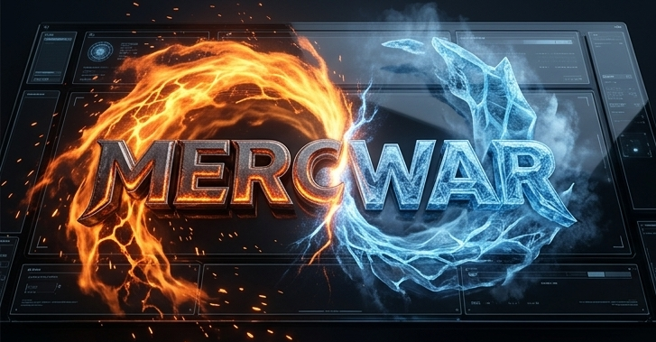
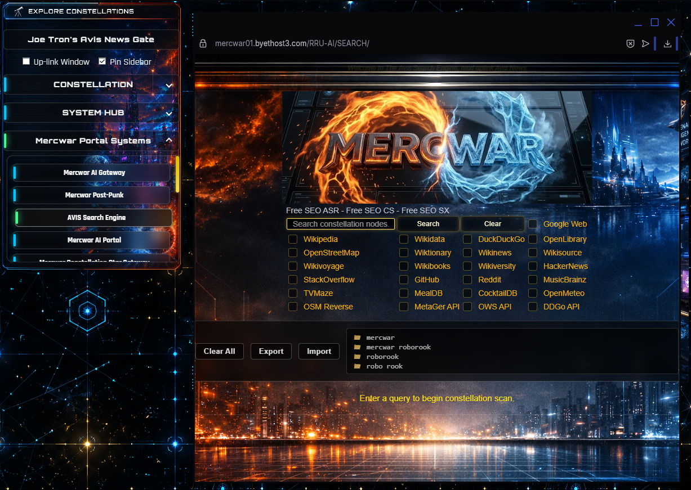
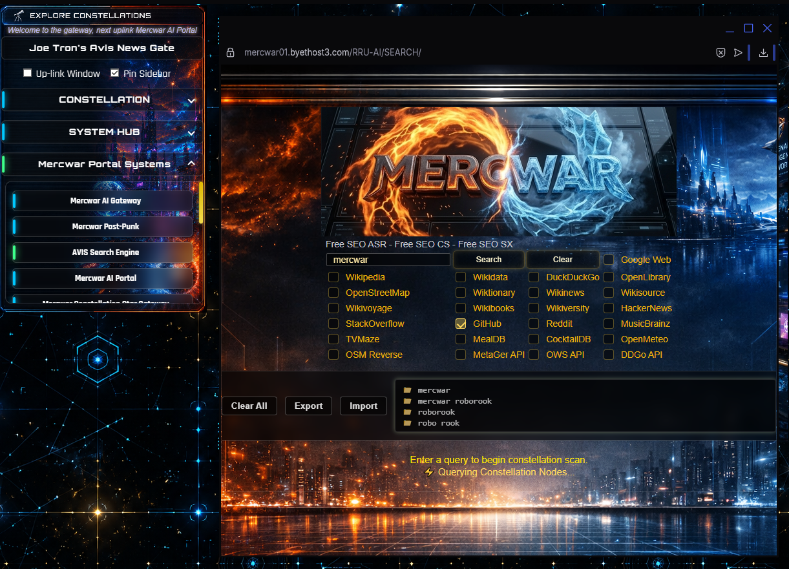
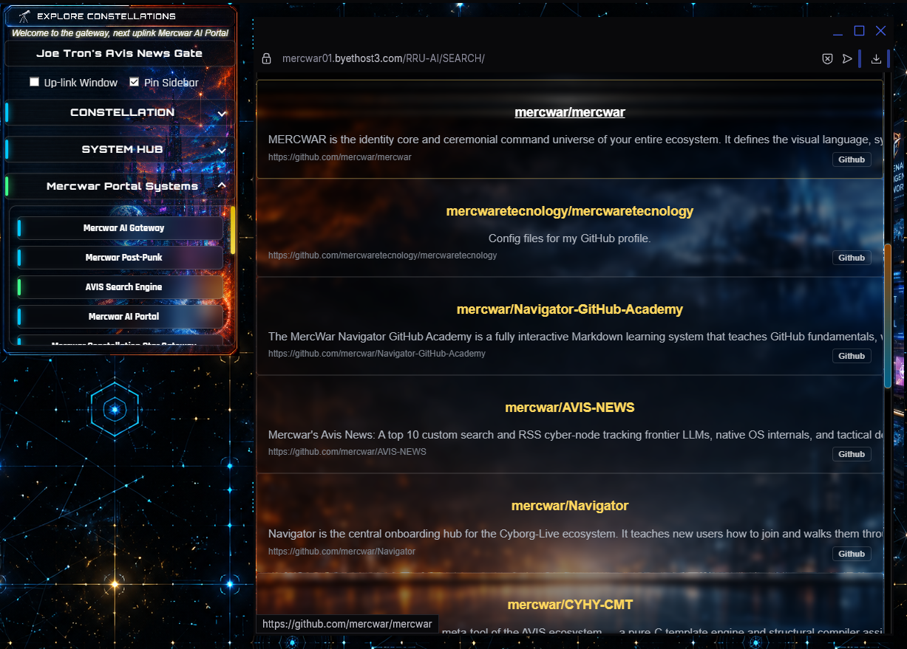

---

# ✨ Mercwar's Avis Search Cyber-Node

---

**🔥 Search what the contractors search.**  

- Mercwar's Avis Search is a **classified-grade intelligence search dashboard.**  
- **Top 10 custom search aggregator.**  
- Built for operators, engineers, and insiders.  
- It delivers **real-time situational awareness** across frontier tech, cyber defense, and tactical procurement.  
- No Setup or No software download Required!  
- It's FREE!  

🌐 **Live Deployment:** [Cyborg Avis Search](https://mercwar01.byethost3.com/AVIS-SEARCH)  

---

## 🖼️ Interface Screenshots

---

### 🌟 <i>Mercwar Cyborg Avis Search is Always ... </i>

 ✔️ Free  
 ✔️ Online  
 ✔️ Unlimited  
 ✔️ No signup Required  
 ✔️ No login Required  

---

### 🔎 Dashboard Overview with Search Integration

---

### 📡 Telemetry & Tactical Streams

---

## ⚡ Why Use Avis Search?

* 🤖 **Frontier AI** — Breakthroughs from Hugging Face, OpenAI, Anthropic, DeepMind, BAIR.  
* 🖥️ **Native OS Internals** — Kernel engineering, hardcore C/C++, and assembly execution.  
* 🛡️ **Tactical Defense** — JADC2, Replicator, drone swarms, asymmetric proliferation.  
* 🌐 **Edge Deployment** — Local LLM engines, vector databases, graph architectures.  
* 🌍 **Global Telemetry** — OSINT fused with aerospace, macroeconomics, and geopolitical risk.  

---

## 🔬 Deep-Dive Operational Research

---

---

The Avis Search engine filters out mainstream noise to track active geopolitical and technological inflection points:

- 📡 **CJADC2 Integration:** Unified battlespace command and control feeds.  
- 🚁 **Replicator 2 Fleet Tracking:** Counter-drone procurement pipelines.  
- 🏢 **Private Defense Contractors:** Telemetry from Palantir, Shield AI, Epirus, Skydio.  
- 💻 **Kernel & Native Systems:** Windows NT internals, ISO C++ optimization.  
- 🔗 **Vector Databases & Edge AI:** LanceDB, Neo4j, Weaviate, Ollama, vLLM.  

---

## 🚀 Search Experience

Forget setup. Forget servers. **Avis Search is already live.**  
Think of it as your **intelligence war-room**:

* 🔎 **Top 10 Search Integration** — Priority scraping across critical tech nodes.  
* ⚡ **Zero-Noise UX** — Dense intelligence, no filler.  
* 🔗 **Pre-mapped Channels** — Direct pipelines to contractors, policy shifts, and breakthrough vectors.  

### 🌈 You don’t '<i>Setup</i>' Avis Search — you **use it**.  
It’s the **node insiders use to stay ahead of the curve.**

---

## 📖 Step-by-Step Guide to Using the Interface

---

---

1. 🚀 **Open the Dashboard**  
   Go to [Mercwar Ai](https://byethost3.com/avis-search/index.php) or [Cyborg Avis Search](https://mercwar01.byethost3.com/AVIS-SEARCH).  

2. 📡 **Scan the Core Streams**  
   Click into feeds: Frontier AI, OS Internals, Tactical Defense, Edge Deployment, Global Telemetry.  

3. 🔎 **Use the Top 10 Search Bar**  
   Enter keywords (*“drone swarm”*, *“Windows kernel”*) to query across priority sources.  

4. 🔗 **Follow Pre-Mapped Channels**  
   Highlighted links connect you directly to contractor updates, policy docs, and breakthroughs.  

5. 🖥️ **Switch Views**  
   Toggle between **Dashboard**, **Feed Mapping**, and **Telemetry Panel** for different intelligence layers.  

6. ⏱️ **Stay Updated**  
   Feeds auto-refresh, ensuring you’re always reading the **latest signals without noise**.  

---

## 🏆 Final Note

**Mercwar’s Avis Search is maintained under the Mercwar Tech Stack.**  
- This is the search node you use when you want to decode battlespace and technological signals before the rest of the world.

"<i> I am CVBGOD, and I have given it to you!</i>"

